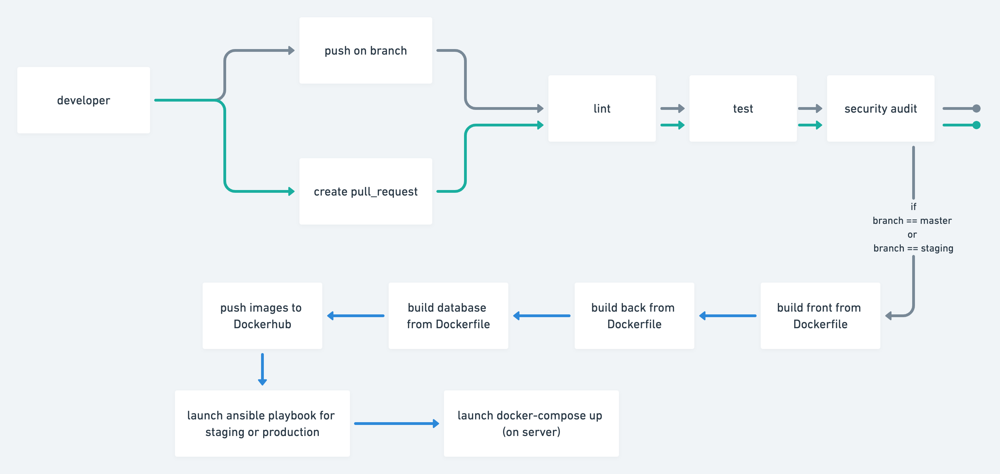

# Devops

## Environnement de développement
Le fichier [`docker-compose`](./docker-compose.tyml) placé à la racine du projet ne sert qu'à lancer l'environnement de développement en local.  
Il est donc normal que le fichier défini des variables d'environnement dites sensibles en clair.  

Le client dispose d'un Dockerfile dédié au **développement** situé dans le dossier [client](./client)  
Le serveur utilise un Dockerfile dédié au **développement** situé dans le dossier [server](./server)  
La base de donnée utilise le Dockerfile de **production** situé dans le dossier [containers](./containers)

## Environnement de production

À part Github aucun service tiers n'est utilisé pour déployer l'application.   
Les instances de production et de pré-production sont hebergées sur [Scaleway](https://www.scaleway.com/en/).  

